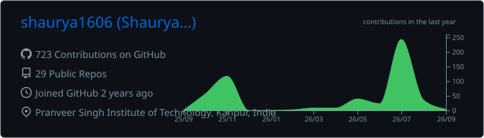
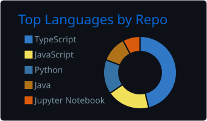
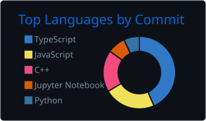
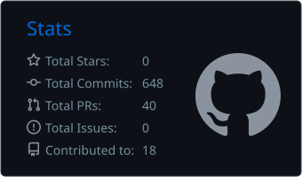
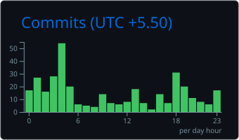

<div align="center">



<p align="center">
  
</p>

# Shaurya Srivastava

### Engineering scalable systems where backend, distributed computing, and AI converge.

<p>
Computer Science Undergraduate • Backend Engineer • AI Systems Builder • Open Source Enthusiast
</p>

</div>

## Connect with Me

<p align="center">

<a href="https://shaurya.letskraack.dev">

</a>

<a href="https://linkedin.com/in/shaurya1606">

</a>

<a href="https://github.com/shaurya1606">

</a>

<a href="https://leetcode.com/u/shaurya1606">

</a>

<a href="https://codeforces.com/profile/shaurya0616">

</a>


  
  
  


</p>

## About Me

<table>
<tr>
<td width="35%" valign="middle" align="center">



</td>
<td width="65%" valign="middle">

I'm **Shaurya Srivastava**, a Computer Science undergraduate passionate about designing scalable software systems that solve practical engineering problems.

My work primarily revolves around backend engineering, distributed systems, developer tooling, artificial intelligence, and modern cloud-native architectures.

I enjoy transforming ideas into production-inspired software by combining clean architecture, efficient algorithms, scalable APIs, and thoughtful system design.

</td>
</tr>
</table>

## Engineering Domains

- Backend Engineering
- Distributed Systems
- Artificial Intelligence
- System Design
- Cloud Computing
- API Design
- Developer Tooling
- Full Stack Development
- Open Source

## 💻 Technology Stack

<table border="1" cellspacing="0" cellpadding="10" width="100%">
<tr>
<td width="50%" valign="top" align="center">

### Languages


</td>
<td width="50%" valign="top" align="center">

### Backend Development


</td>
</tr>
<tr>
<td width="50%" valign="top" align="center">

### Frontend Development


</td>
<td width="50%" valign="top" align="center">

### Databases


</td>
</tr>
<tr>
<td width="50%" valign="top" align="center">

### AI / Machine Learning


</td>
<td width="50%" valign="top" align="center">

### Cloud • DevOps


</td>
</tr>
<tr>
<td width="50%" valign="top" align="center">

### Developer Tools


</td>
<td width="50%" valign="top" align="center">

### Frameworks & Runtime


</td>
</tr>
</table>

## ⚙️ Engineering Expertise

<table border="1" cellspacing="0" cellpadding="12" width="100%">
<tr>
<td width="33.33%" valign="top">

### Backend Engineering

- REST API Design
- Authentication & Authorization
- JWT • OAuth • RBAC
- Microservices
- WebSockets
- Server-Sent Events
- Async Programming
- Concurrent Programming
- Distributed Systems

</td>
<td width="33.33%" valign="top">

### Software Engineering

- Clean Architecture
- SOLID Principles
- Design Patterns
- System Design
- Database Design
- Performance Optimization
- Unit Testing
- CI/CD
- Agile Development

</td>
<td width="33.33%" valign="top">

### Artificial Intelligence

- Large Language Models
- Prompt Engineering
- RAG
- Computer Vision
- NLP
- Speech-to-Text
- Text-to-Speech
- Model Evaluation
- YOLO

</td>
</tr>
<tr>
<td width="33.33%" valign="top">

### Cloud & Infrastructure

- Docker
- GitHub Actions
- AWS
- Linux
- Nginx
- Deployment Automation
- Monitoring
- Logging
- Reverse Proxy

</td>
<td width="33.33%" valign="top">

### Developer Practices

- Git Workflow
- Code Reviews
- Technical Documentation
- Problem Solving
- Debugging
- API Testing
- Postman
- Database Optimization
- Secure Coding
- Agile Collaboration

</td>
<td width="33.33%" valign="top">

### Core Computer Science

- Data Structures & Algorithms
- Object-Oriented Programming
- Operating Systems
- Database Management Systems
- Computer Networks
- SQL Optimization
- Complexity Analysis
- Multithreading
- Memory Management
- Problem Solving

</td>
</tr>
</table>

## 🚀 Featured Projects

<table border="1" cellspacing="0" cellpadding="14" width="100%">

<tr>

<td width="50%" valign="top">

<table border="1" cellspacing="0" cellpadding="12" width="100%">
<tr>
<td valign="top">

## QueueCTL

**CLI-first Distributed Job Queue**

A production-inspired distributed task processing system featuring worker orchestration, retries, scheduling, dead-letter queues, monitoring, and asynchronous execution.

**Domain**

`Distributed Systems` • `Developer Tools`

**Tech**

TypeScript • Node.js • SQLite • CLI • Worker Architecture

[Repository](https://github.com/shaurya1606/flam-software-intern-project)

</td>
</tr>
</table>

</td>

<td width="50%" valign="top">

<table border="1" cellspacing="0" cellpadding="12" width="100%">
<tr>
<td valign="top">

## LetsKraack

**AI Career Preparation Platform**

AI-powered interview preparation platform integrating Speech-to-Text, LLM evaluation, resume analysis, personalized learning, and real-time interview workflows.

**Domain**

`Artificial Intelligence` • `EdTech`

**Tech**

Next.js • TypeScript • PostgreSQL • AssemblyAI • Gemini • AWS Polly

[Repository](https://github.com/shaurya1606/LetsKraack.Ai)

</td>
</tr>
</table>

</td>

</tr>

<tr>

<td width="50%" valign="top">

<table border="1" cellspacing="0" cellpadding="12" width="100%">
<tr>
<td valign="top">

## PerformIQ

**Enterprise Performance Management**

Enterprise SaaS platform implementing RBAC, approval workflows, KPI governance, multi-role dashboards, and secure authentication.

**Domain**

`Enterprise SaaS`

**Tech**

Next.js • TypeScript • PostgreSQL • RBAC • Authentication

[Repository](https://github.com/shaurya1606/PerformIQ)

</td>
</tr>
</table>

</td>

<td width="50%" valign="top">

<table border="1" cellspacing="0" cellpadding="12" width="100%">
<tr>
<td valign="top">

## Sarion

**AI Disaster Response Platform**

Computer vision powered disaster response simulation integrating AI detection, telemetry, path planning, and emergency coordination.

**Domain**

`Artificial Intelligence`

`Computer Vision`

**Tech**

Python • YOLO • FastAPI • OpenCV

[Repository](https://github.com/shaurya1606/Sarion)

</td>
</tr>
</table>

</td>

</tr>

<tr>

<td width="50%" valign="top">

<table border="1" cellspacing="0" cellpadding="12" width="100%">
<tr>
<td valign="top">

## Society Management System

Multi-role society administration platform with authentication, resident management, complaints, maintenance, announcements, and dashboard analytics.

**Domain**

`Full Stack`

`MERN`

**Tech**

TypeScript • React • Node.js • Database

[Repository](https://github.com/shaurya1606/society-management)

</td>
</tr>
</table>

</td>

<td width="50%" valign="top">

<table border="1" cellspacing="0" cellpadding="12" width="100%">
<tr>
<td valign="top">

## AI-Powered Phishing Detection

Machine learning driven phishing detection system capable of analysing URLs, emails, and webpages for malicious behaviour.

**Domain**

`Cyber Security`

`Machine Learning`

**Tech**

Python • Scikit-Learn • NLP • Machine Learning

[Repository](https://github.com/shaurya1606/AI-Powered-Phishing-detection-and-Mitigation)

</td>
</tr>
</table>

</td>

</tr>

<tr>

<td width="50%" valign="top">

<table border="1" cellspacing="0" cellpadding="12" width="100%">
<tr>
<td valign="top">

## Fire & Smoke Detection

Real-time fire and smoke detection using deep learning and computer vision with emergency alert capabilities.

**Domain**

`Computer Vision`

`Deep Learning`

**Tech**

Python • OpenCV • CNN • PyTorch

[Repository](https://github.com/shaurya1606/Advance-fire-and-smoke-detection-system)

</td>
</tr>
</table>

</td>

<td width="50%" valign="top">

<table border="1" cellspacing="0" cellpadding="12" width="100%">
<tr>
<td valign="top">

## Human Detection with YOLOv8

Real-time human detection system supporting multiple camera feeds, object tracking, and automated alerts.

**Domain**

`Computer Vision`

**Tech**

Python • YOLOv8 • OpenCV

[Repository](https://github.com/shaurya1606/Human-Detection-System-with-YOLOv8)

</td>
</tr>
</table>

</td>

</tr>

<tr>

<td width="50%" valign="top">

<table border="1" cellspacing="0" cellpadding="12" width="100%">
<tr>
<td valign="top">

## Saarthi

Smart healthcare vending solution combining React Native, backend APIs, payment workflows, and inventory management.

**Domain**

`Mobile Development`

`Healthcare`

**Tech**

React Native • TypeScript • Python

[Repository](https://github.com/shaurya1606/Saarthi-React-Native-App)

</td>
</tr>
</table>

</td>

<td width="50%" valign="top">

<table border="1" cellspacing="0" cellpadding="12" width="100%">
<tr>
<td valign="top">

## UPI Java

Java implementation of core UPI concepts demonstrating transaction workflows, account management, and payment processing.

**Domain**

`Java`

`Backend`

**Tech**

Java • OOP • Collections

[Repository](https://github.com/shaurya1606/UPI-Java)

</td>
</tr>
</table>

</td>

</tr>

</table>

## 📦 Other Notable Projects

<p>
  <a href="#" style="display:inline-block; margin:4px 6px 4px 0; padding:8px 12px; border:1px solid #2f81f7; border-radius:999px; text-decoration:none; color:#e6edf3; background:#0d1117; font-size:13px; line-height:1.4;">
    🍔 <strong>Food Fiesta</strong> — Restaurant management application built in Java.
  </a>
  <a href="#" style="display:inline-block; margin:4px 6px 4px 0; padding:8px 12px; border:1px solid #2f81f7; border-radius:999px; text-decoration:none; color:#e6edf3; background:#0d1117; font-size:13px; line-height:1.4;">
    📱 <strong>Sticker Smasher</strong> — React Native mobile application exploring modern mobile UI development.
  </a>
  <a href="#" style="display:inline-block; margin:4px 6px 4px 0; padding:8px 12px; border:1px solid #2f81f7; border-radius:999px; text-decoration:none; color:#e6edf3; background:#0d1117; font-size:13px; line-height:1.4;">
    📄 <strong>Resume Analyser AI (Java)</strong> — AI-assisted resume evaluation and parsing.
  </a>
  <a href="#" style="display:inline-block; margin:4px 6px 4px 0; padding:8px 12px; border:1px solid #2f81f7; border-radius:999px; text-decoration:none; color:#e6edf3; background:#0d1117; font-size:13px; line-height:1.4;">
    🎵 <strong>Interactive Music Web App</strong> — Browser-based music streaming application.
  </a>
  <a href="#" style="display:inline-block; margin:4px 6px 4px 0; padding:8px 12px; border:1px solid #2f81f7; border-radius:999px; text-decoration:none; color:#e6edf3; background:#0d1117; font-size:13px; line-height:1.4;">
    📈 <strong>Stock Market Forecast</strong> — Time-series forecasting and visualization using Python.
  </a>
  <a href="#" style="display:inline-block; margin:4px 6px 4px 0; padding:8px 12px; border:1px solid #2f81f7; border-radius:999px; text-decoration:none; color:#e6edf3; background:#0d1117; font-size:13px; line-height:1.4;">
    💬 <strong>Mystery Message</strong> — Anonymous messaging platform.
  </a>
  <a href="#" style="display:inline-block; margin:4px 6px 4px 0; padding:8px 12px; border:1px solid #2f81f7; border-radius:999px; text-decoration:none; color:#e6edf3; background:#0d1117; font-size:13px; line-height:1.4;">
    🎯 <strong>Authentication &amp; Authorization</strong> — Production-inspired authentication system with secure user workflows.
  </a>
  <a href="#" style="display:inline-block; margin:4px 6px 4px 0; padding:8px 12px; border:1px solid #2f81f7; border-radius:999px; text-decoration:none; color:#e6edf3; background:#0d1117; font-size:13px; line-height:1.4;">
    🕹️ <strong>Collection of frontend experiments</strong> including Pong, Tic-Tac-Toe, Snake Game, Product Table, and other learning projects.
  </a>
</p>

## 📊 GitHub Analytics


<div align="center">


</div>

## 📈 GitHub Summary

<div align="center">



</div>

<br>

<div align="center">





</div>

<br>

<div align="center">





</div>

## 📈 Contribution Activity

<div align="center">


</div>

<!--

## 🏆 GitHub Trophies

<p align="center">


</p>

--> 

## 📊 Development Metrics

<div align="center">


</div>

## 💻 Competitive Programming

<div align="center">


<a href="https://www.codechef.com/users/shaurya1612">
    
</a>

</div>

<br>

<div align="center">

| Platform | Highlights |
|-----------|------------|
| 🟠 LeetCode | 300+ Problems Solved • Contest Rating ~1570 |
| 🔵 Codeforces | Specialist • Peak Rating 1546 |
| 🟢 HackerRank | Problem Solving • SQL |
| 🟤 CodeChef | Regular Practice |
| ⚪ GeeksforGeeks | DSA Practice |

</div>

## 🎯 Engineering Highlights

- 🏆 Winner — **PSIT Tech Expo 2024** (Fire & Smoke Detection System)
- 🏆 Winner — **PSIT Tech Expo 2025** (LetsKraack AI Platform)
- 🚀 Built **15+** software engineering projects.
- 🧠 Solved **300+** DSA problems.
- ⚙️ Designed enterprise-grade authentication systems with RBAC and MFA.
- 🤖 Developed AI systems using LLMs, Computer Vision, Speech-to-Text, and Retrieval-Augmented Generation.
- ☁️ Built cloud-ready applications using Docker, GitHub Actions, AWS, and PostgreSQL.
- 🛰️ Worked on distributed systems, asynchronous processing, and workflow orchestration.

## 🌱 Currently Exploring

```text
✓ Distributed Systems

✓ Event-Driven Architecture

✓ Spring Boot

✓ Microservices

✓ Kubernetes

✓ Cloud Native Development

✓ AI Agents

✓ Platform Engineering

✓ High Performance Backend Systems
```

## 🤝 Open Source Goals

In 2026, I'm focusing on:

- Building production-quality open-source software.
- Contributing to developer tooling and backend ecosystems.
- Writing technical documentation and architecture guides.
- Publishing reusable libraries and engineering utilities.
- Collaborating on distributed systems and AI infrastructure projects.

## 🐍 Contribution Snake

<p align="center">
  
</p>

## 🗺️ Engineering Journey

```text
2024 ─ Web Development
       │
2025 ─ Backend Engineering
       │
2025 ─ Enterprise SaaS
       │
2026 ─ AI Systems
       │
2026 ─ Distributed Systems
       │
2027 → Platform Engineering
```

### "Build systems that scale. Write code that lasts."

⭐ If you like my work, consider following my journey.


### Thanks for visiting!


</div>
